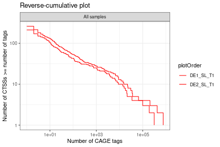
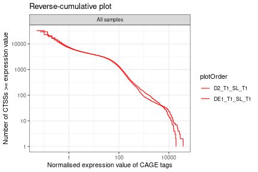

```r
library(CAGErAid) |> suppressPackageStartupMessages()
library('CAGEr') |> suppressPackageStartupMessages()
library('ggplot2'); theme_set(theme_bw())
```

Let's load in the polished data from [the previous vignette](vignettes/loading_polishing.Rmd):


```r
ce_path <- system.file("extdata/example_CAGEexp", package="CAGErAid") |>
  list.files(pattern = '*toOSA_polished*', full.names = TRUE)

ce <- SimpleList()
ce$OKItoOSA <- readRDS(ce_path[1])
ce$OSAtoOSA <- readRDS(ce_path[2])
```

Let's also load in the GFF file for annotating clusters:


```r
gff <- system.file("extdata", "Osaka.gtf", package="CAGErAid") |>
  quickGFF()
```

We separate SL containing samples and check for power law distribution.


```r

for (i in names(ce)) {
  ce[[i]] <- ce[[i]][, ce[[i]]$SLfound]
}

sapply(ce, \(x) plot(plotReverseCumulatives(x, fitInRange = NULL, values = 'raw')))
```



```
#>             OKItoOSA         OSAtoOSA        
#> data        data.frame,5     data.frame,5    
#> layers      list,1           list,1          
#> scales      ScalesList,2     ScalesList,2    
#> mapping     uneval,3         uneval,3        
#> theme       list,0           list,0          
#> coordinates CoordCartesian,5 CoordCartesian,5
#> facet       FacetWrap,3      FacetWrap,3     
#> plot_env    ?                ?               
#> labels      list,4           list,4
```

As seen in the reverse cumulative plot, samples with SL do not follow a power law distribution. In this case we use simple TPM normalization.


```r

ce <- sapply(ce, \(x) normalizeTagCount(x, method = 'simpleTpm')) |>
  suppressWarnings()
#> 
#> Normalizing tag count...
#> 
#> Normalizing tag count...
sapply(ce, \(x) plot(plotReverseCumulatives(x, fitInRange = NULL, values = 'normalized')))
```



```
#>             OKItoOSA         OSAtoOSA        
#> data        data.frame,5     data.frame,5    
#> layers      list,1           list,1          
#> scales      ScalesList,2     ScalesList,2    
#> mapping     uneval,3         uneval,3        
#> theme       list,0           list,0          
#> coordinates CoordCartesian,5 CoordCartesian,5
#> facet       FacetWrap,3      FacetWrap,3     
#> plot_env    ?                ?               
#> labels      list,4           list,4
```

After normalization, we can cluster the CTSSs. First, let's annotate the data.


```r
ce <- sapply(ce, \(x) annotateCTSS(x, gff)) |> suppressWarnings()
```

Now we can find consensus clusters with the use of `quickCC()`. For SL-containing samples, the function uses the paraclu algorithm.


```r
ce <- sapply(ce, \(x) quickCC(x, sl_found = TRUE, gff = gff, nr_samples = 1)) |>
  suppressWarnings()
#> 
#> Filtering out CTSSs below threshold...
#> Clustering...
#> 	-> DE1_SL_T1
#> 	-> DE2_SL_T1
#> 
#> Calculating cumulative sum of CAGE signal along clusters...
#> 	-> DE1_SL_T1
#> 	-> DE2_SL_T1
#> 
#> Getting positions of quantiles within clusters...
#> 	-> DE1_SL_T1
#> 	-> DE2_SL_T1
#> 	-> all samples grouped
#> 
#> Filtering out CTSSs below threshold...
#> Clustering...
#> 	-> D2_T1_SL_T1
#> 	-> DE1_T1_SL_T1
#> 
#> Calculating cumulative sum of CAGE signal along clusters...
#> 	-> D2_T1_SL_T1
#> 	-> DE1_T1_SL_T1
#> 
#> Getting positions of quantiles within clusters...
#> 	-> D2_T1_SL_T1
#> 	-> DE1_T1_SL_T1
#> 	-> all samples grouped
```

Finally, we can save the CAGEexp objects and export the data to the bed format for visualisation.


