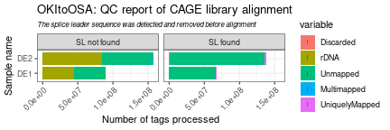
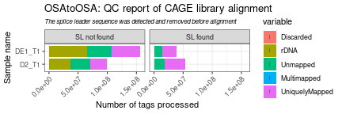
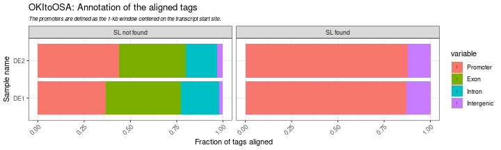
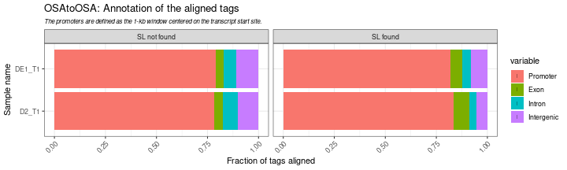
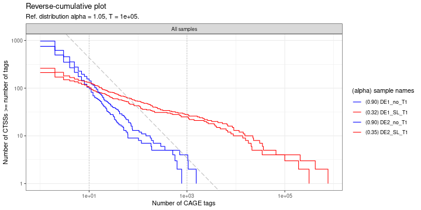
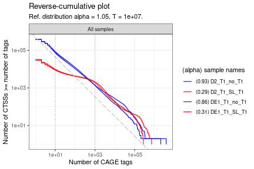

```r
library(CAGErAid) |> suppressPackageStartupMessages()
library(CAGEr) |> suppressPackageStartupMessages()
library(S4Vectors) |> suppressPackageStartupMessages()
library(SummarizedExperiment) |> suppressPackageStartupMessages()
library(ggplot2); theme_set(theme_bw())
```

This vignette uses a limited number of samples from the cross-alignments experiment. To extract CTSS data, see [`getCTSS()`](https://rdrr.io/bioc/CAGEr/man/getCTSS.html). Let's load and examine the pre-extracted CTSS data:


```r

ce_path <- system.file("extdata/example_CAGEexp", package="CAGErAid") |>
  list.files(pattern = '*toOSA.rds', full.names = TRUE)

ce <- SimpleList()
ce$OKItoOSA <- readRDS(ce_path[1])
ce$OSAtoOSA <- readRDS(ce_path[2])

sapply(ce, \(x) colData(x))
#> $OKItoOSA
#> DataFrame with 4 rows and 4 columns
#>                       inputFiles sampleLabels inputFilesType librarySizes
#>                      <character>  <character>    <character>    <integer>
#> DE1_no_T1 /bucket/LuscombeU/li..    DE1_no_T1   bamPairedEnd         6691
#> DE1_SL_T1 /bucket/LuscombeU/li..    DE1_SL_T1   bamPairedEnd       793418
#> DE2_no_T1 /bucket/LuscombeU/li..    DE2_no_T1   bamPairedEnd        11081
#> DE2_SL_T1 /bucket/LuscombeU/li..    DE2_SL_T1   bamPairedEnd      1720055
#> 
#> $OSAtoOSA
#> DataFrame with 4 rows and 4 columns
#>                          inputFiles sampleLabels inputFilesType librarySizes
#>                         <character>  <character>    <character>    <integer>
#> D2_T1_no_T1  /bucket/LuscombeU/li..  D2_T1_no_T1   bamPairedEnd     15988506
#> D2_T1_SL_T1  /bucket/LuscombeU/li..  D2_T1_SL_T1   bamPairedEnd     19388358
#> DE1_T1_no_T1 /bucket/LuscombeU/li.. DE1_T1_no_T1   bamPairedEnd     23830411
#> DE1_T1_SL_T1 /bucket/LuscombeU/li.. DE1_T1_SL_T1   bamPairedEnd     14225646
```

The data contains the first two samples from the Okinawa and Osaka O. dioica reads aligned to the Osaka genome, one with splice leader sequences removed, and one containing splice leader sequences. To get more information on the samples and statistics from the nf-core pipeline, let's use `quickPolish()` and `quickMQC()`.


```r

ce <- sapply(ce, \(x) quickPolish(x))
sapply(ce, \(x) colData(x))
#> $OKItoOSA
#> DataFrame with 4 rows and 10 columns
#>                       inputFiles sampleLabels inputFilesType librarySizes       reads
#>                      <character>  <character>    <character>    <integer> <character>
#> DE1_no_T1 /bucket/LuscombeU/li..    DE1_no_T1   bamPairedEnd         6691         Oki
#> DE1_SL_T1 /bucket/LuscombeU/li..    DE1_SL_T1   bamPairedEnd       793418         Oki
#> DE2_no_T1 /bucket/LuscombeU/li..    DE2_no_T1   bamPairedEnd        11081         Oki
#> DE2_SL_T1 /bucket/LuscombeU/li..    DE2_SL_T1   bamPairedEnd      1720055         Oki
#>             SLfound     SLfactor  sampleType         RNA            Description
#>           <logical>     <factor> <character> <character>            <character>
#> DE1_no_T1     FALSE SL not found       Adult         DE1 Oikopleura dioica (O..
#> DE1_SL_T1      TRUE SL found           Adult         DE1 Oikopleura dioica (O..
#> DE2_no_T1     FALSE SL not found       Adult         DE2 Oikopleura dioica (O..
#> DE2_SL_T1      TRUE SL found           Adult         DE2 Oikopleura dioica (O..
#> 
#> $OSAtoOSA
#> DataFrame with 4 rows and 10 columns
#>                          inputFiles sampleLabels inputFilesType librarySizes
#>                         <character>  <character>    <character>    <integer>
#> D2_T1_no_T1  /bucket/LuscombeU/li..  D2_T1_no_T1   bamPairedEnd     15988506
#> D2_T1_SL_T1  /bucket/LuscombeU/li..  D2_T1_SL_T1   bamPairedEnd     19388358
#> DE1_T1_no_T1 /bucket/LuscombeU/li.. DE1_T1_no_T1   bamPairedEnd     23830411
#> DE1_T1_SL_T1 /bucket/LuscombeU/li.. DE1_T1_SL_T1   bamPairedEnd     14225646
#>                    reads   SLfound     SLfactor  sampleType         RNA
#>              <character> <logical>     <factor> <character> <character>
#> D2_T1_no_T1          Osa     FALSE SL not found       JuvD2       D2_T1
#> D2_T1_SL_T1          Osa      TRUE SL found           JuvD2       D2_T1
#> DE1_T1_no_T1         Osa     FALSE SL not found       Adult      DE1_T1
#> DE1_T1_SL_T1         Osa      TRUE SL found           Adult      DE1_T1
#>                         Description
#>                         <character>
#> D2_T1_no_T1  Oikopleura dioica (O..
#> D2_T1_SL_T1  Oikopleura dioica (O..
#> DE1_T1_no_T1 Oikopleura dioica (O..
#> DE1_T1_SL_T1 Oikopleura dioica (O..
```


```r

ce <- sapply(ce, \(x) quickMQC(x))
sapply(ce, \(x) colData(x))
#> $OKItoOSA
#> DataFrame with 4 rows and 16 columns
#>                       inputFiles sampleLabels inputFilesType librarySizes       reads
#>                      <character>  <character>    <character>    <integer> <character>
#> DE1_no_T1 /bucket/LuscombeU/li..    DE1_no_T1   bamPairedEnd         6691         Oki
#> DE1_SL_T1 /bucket/LuscombeU/li..    DE1_SL_T1   bamPairedEnd       793418         Oki
#> DE2_no_T1 /bucket/LuscombeU/li..    DE2_no_T1   bamPairedEnd        11081         Oki
#> DE2_SL_T1 /bucket/LuscombeU/li..    DE2_SL_T1   bamPairedEnd      1720055         Oki
#>             SLfound     SLfactor  sampleType         RNA            Description
#>           <logical>     <factor> <character> <character>            <character>
#> DE1_no_T1     FALSE SL not found       Adult         DE1 Oikopleura dioica (O..
#> DE1_SL_T1      TRUE SL found           Adult         DE1 Oikopleura dioica (O..
#> DE2_no_T1     FALSE SL not found       Adult         DE2 Oikopleura dioica (O..
#> DE2_SL_T1      TRUE SL found           Adult         DE2 Oikopleura dioica (O..
#>           paired_aligned_one paired_aligned_multi paired_total realLibrarySizes
#>                    <integer>            <integer>    <integer>        <numeric>
#> DE1_no_T1              34052                98098     45036397         89762138
#> DE1_SL_T1            1363267                13666     67806997         67956188
#> DE2_no_T1              62510               244083     72818282        157076012
#> DE2_SL_T1            2695861                19142    137763090        138124640
#>           extracted      rdna
#>           <numeric> <numeric>
#> DE1_no_T1  89649244  44612847
#> DE1_SL_T1  67855741     48744
#> DE2_no_T1 156844691  84026409
#> DE2_SL_T1 137854528     91438
#> 
#> $OSAtoOSA
#> DataFrame with 4 rows and 16 columns
#>                          inputFiles sampleLabels inputFilesType librarySizes
#>                         <character>  <character>    <character>    <integer>
#> D2_T1_no_T1  /bucket/LuscombeU/li..  D2_T1_no_T1   bamPairedEnd     15988506
#> D2_T1_SL_T1  /bucket/LuscombeU/li..  D2_T1_SL_T1   bamPairedEnd     19388358
#> DE1_T1_no_T1 /bucket/LuscombeU/li.. DE1_T1_no_T1   bamPairedEnd     23830411
#> DE1_T1_SL_T1 /bucket/LuscombeU/li.. DE1_T1_SL_T1   bamPairedEnd     14225646
#>                    reads   SLfound     SLfactor  sampleType         RNA
#>              <character> <logical>     <factor> <character> <character>
#> D2_T1_no_T1          Osa     FALSE SL not found       JuvD2       D2_T1
#> D2_T1_SL_T1          Osa      TRUE SL found           JuvD2       D2_T1
#> DE1_T1_no_T1         Osa     FALSE SL not found       Adult      DE1_T1
#> DE1_T1_SL_T1         Osa      TRUE SL found           Adult      DE1_T1
#>                         Description paired_aligned_one paired_aligned_multi
#>                         <character>          <integer>            <integer>
#> D2_T1_no_T1  Oikopleura dioica (O..           28101869               422201
#> D2_T1_SL_T1  Oikopleura dioica (O..           35382117               310598
#> DE1_T1_no_T1 Oikopleura dioica (O..           49499015               888382
#> DE1_T1_SL_T1 Oikopleura dioica (O..           24499459               181375
#>              paired_total realLibrarySizes extracted      rdna
#>                 <integer>        <numeric> <numeric> <numeric>
#> D2_T1_no_T1      62079678         98713905  98599355  36519677
#> D2_T1_SL_T1      53639240         53735899  53675760     36520
#> DE1_T1_no_T1     92107281        156998772 156802134  64694853
#> DE1_T1_SL_T1     38901799         39019742  38965260     63461
```

After adding the statistics metadata from the pipeline, we can visualise them to compare the levels of aligned reads to the genome.


```r

plotAnnot_ <- function(name)
  CAGEr::plotAnnot(ce[[name]], msScope_nfcore_rnaseq, group = 'RNA', facet = 'SLfactor', norm = FALSE) +
      ylab('Number of tags processed') +
      xlab('Sample name') +
      scale_y_continuous(guide = guide_axis(angle = 45)) +
      theme(plot.subtitle=element_text(size=8, face="italic")) +
      ggtitle(paste0(name, ': QC report of CAGE library alignment'),
              sub = 'The splice leader sequence was detected and removed before alignment')

for (name in names(ce)) plot(plotAnnot_(name))
#> Warning: Removed 20 rows containing missing values (`geom_segment()`).
#> Warning: Removed 20 rows containing missing values (`geom_point()`).
```



```
#> Warning: Removed 20 rows containing missing values (`geom_segment()`).
#> Removed 20 rows containing missing values (`geom_point()`).
```



There are noticeably less Okinawa reads mapped to the Osaka genome, but there is still a substantial number of unmapped Osaka reads. We can also see the difference in the SL-containing samples and those with SL removed.

Let's annotate the CTSSs and examine the proportions of sequence elements in the data, starting with loading the GFF file with `quickGFF()`:


```r

gff <- system.file("extdata", "Osaka.gtf", package="CAGErAid") |>
  quickGFF()

ce <- sapply(ce, \(x) annotateCTSS(x, gff)) |> suppressWarnings()

for (i in names(ce)) {
  print(names(ce[i]))
  print(colData(ce[[i]])[,c('promoter', 'exon', 'intron', 'unknown')] |> as.matrix() |> prop.table(1)  |> round(2))
        }
#> [1] "OKItoOSA"
#>           promoter exon intron unknown
#> DE1_no_T1     0.37 0.40   0.21    0.02
#> DE1_SL_T1     0.87 0.00   0.00    0.13
#> DE2_no_T1     0.44 0.36   0.17    0.03
#> DE2_SL_T1     0.88 0.00   0.00    0.12
#> [1] "OSAtoOSA"
#>              promoter exon intron unknown
#> D2_T1_no_T1      0.78 0.04   0.08    0.10
#> D2_T1_SL_T1      0.84 0.08   0.04    0.05
#> DE1_T1_no_T1     0.79 0.03   0.06    0.11
#> DE1_T1_SL_T1     0.82 0.06   0.04    0.08

plotAnnot_ <- function(name) {
  plotAnnot(ce[[name]], 'counts', group = 'RNA', facet = 'SLfactor', normalise = TRUE) +
      ylab('Fraction of tags aligned') +
      xlab('Sample name') +
      scale_y_continuous(guide = guide_axis(angle = 45)) +
      theme(plot.subtitle=element_text(size=8, face="italic")) +
      ggtitle(paste0(name, ': Annotation of the aligned tags'),
              sub = 'The promoters are defined as the 1-kb window centered on the transcript start site.')}

for (name in names(ce)) plot(plotAnnot_(name))
#> Warning: Removed 16 rows containing missing values (`geom_segment()`).
#> Warning: Removed 16 rows containing missing values (`geom_point()`).
```



```
#> Warning: Removed 16 rows containing missing values (`geom_segment()`).
#> Removed 16 rows containing missing values (`geom_point()`).
```




```r
colors <- c('blue', 'red', 'blue', 'red')
ce <- sapply(ce, \(x) setColors(x, colors))

plotReverseCumulatives(ce$OKItoOSA, values = "raw")
```



```r
plotReverseCumulatives(ce$OSAtoOSA, values = "raw")
```



We can see that the samples without SL (blue) roughly follow a power-law distribution, while the SL samples do not (red). This can be used for choosing an appropriate method for normalization. Finally, we can save the polished data for further steps: clustering of either [the SL-containing samples](clustering_sl.html) or [samples without SL](clustering_no.html).


